# All test cases

Reference (MS Word) on the left, docxide-pdf on the right.

## case1 — 85.8% SSIM

 

## case2 — 94.3% SSIM

 

## case3 — 89.4% SSIM

 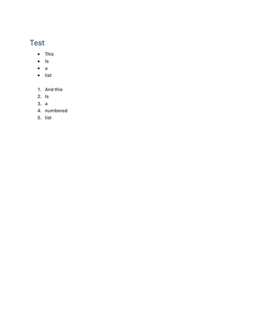

## case4 — 89.5% SSIM

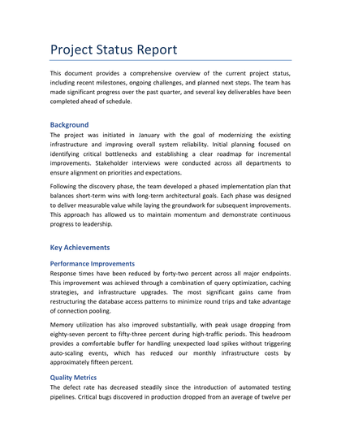 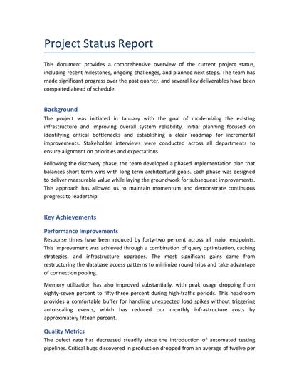

## case5 — 90.3% SSIM

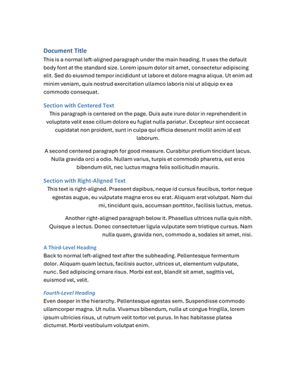 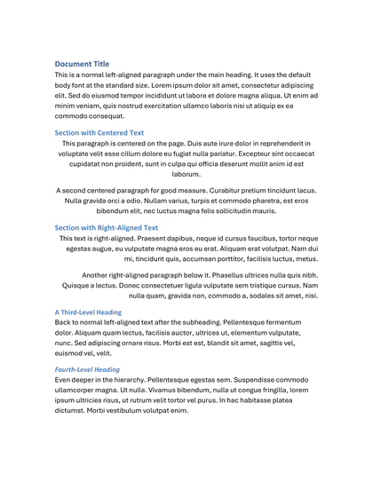

## case6 — 85.3% SSIM

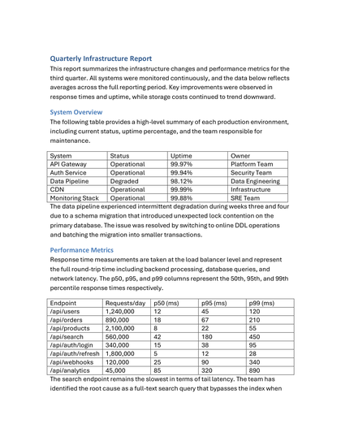 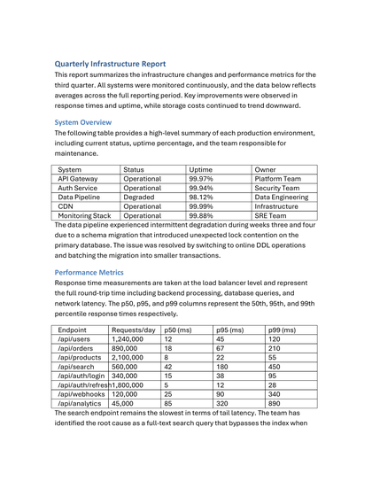

## case7 — 91.7% SSIM

 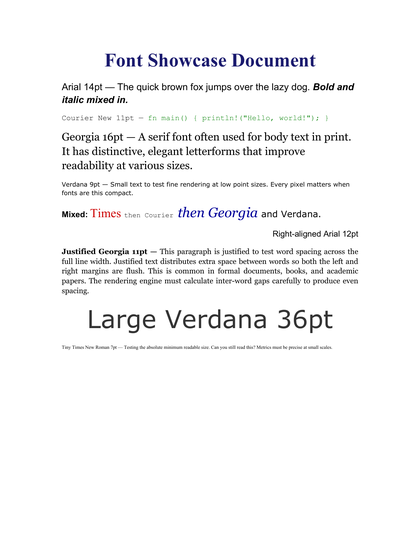

## case8 — 94.1% SSIM

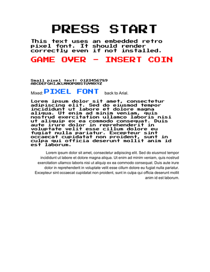 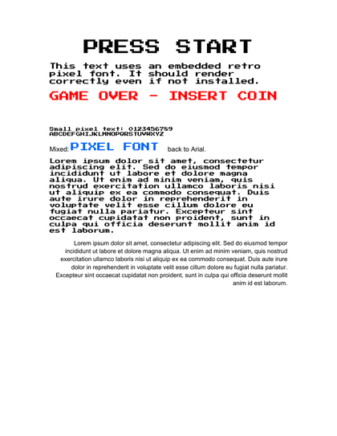

## case9 — 90.1% SSIM

 

## case10 — 84.6% SSIM

 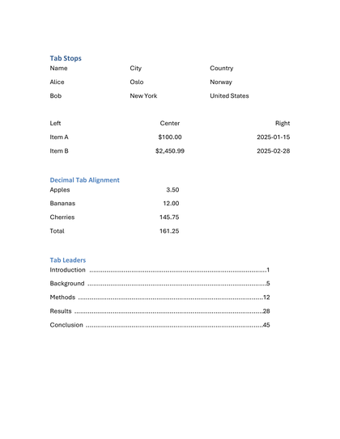

## case11 — 91.5% SSIM

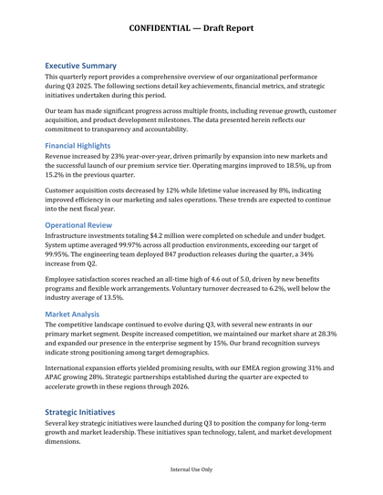 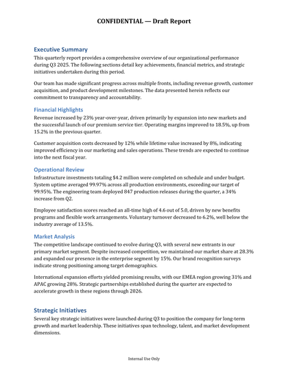

## case12 — 99.5% SSIM

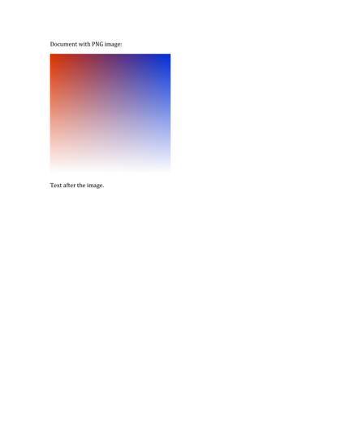 

## case13 — 91.7% SSIM

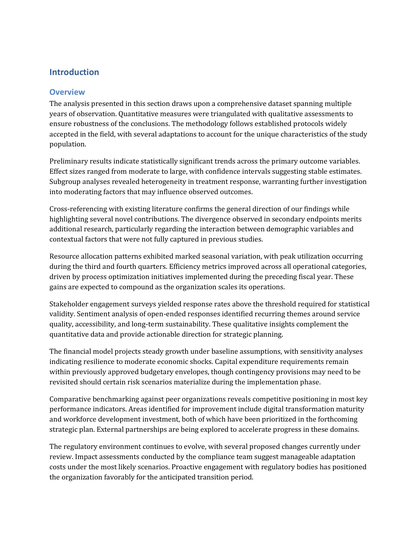 

## case14 — 88.2% SSIM

 

## case15 — 87.5% SSIM

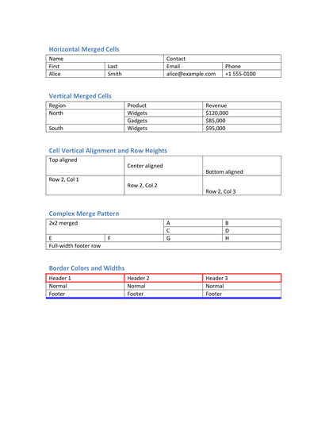 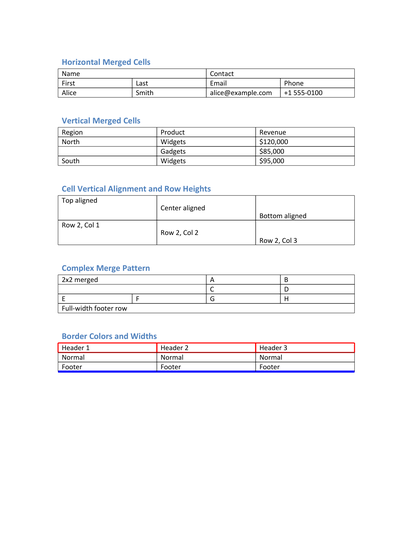

## case16 — 75.8% SSIM

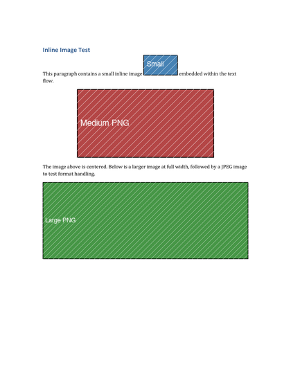 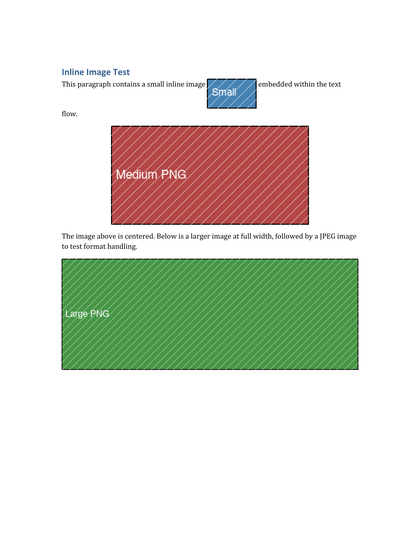

## case17 — 96.8% SSIM

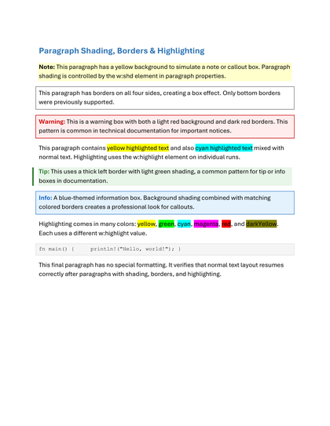 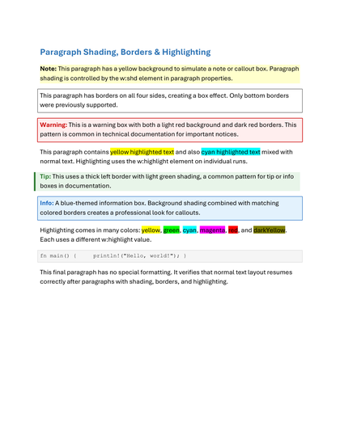

## case18 — 80.6% SSIM

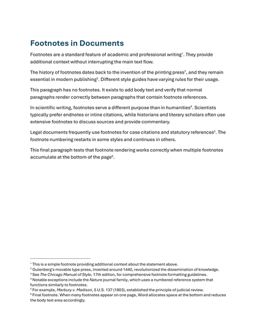 

## case19 — 99.9% SSIM

 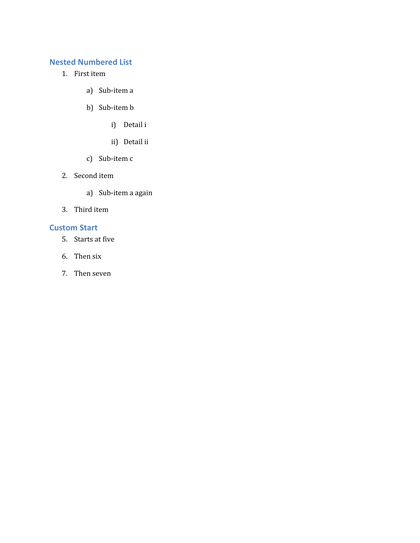

## case20 — 99.8% SSIM

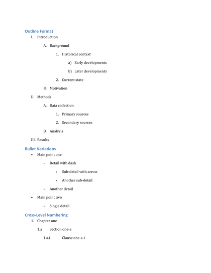 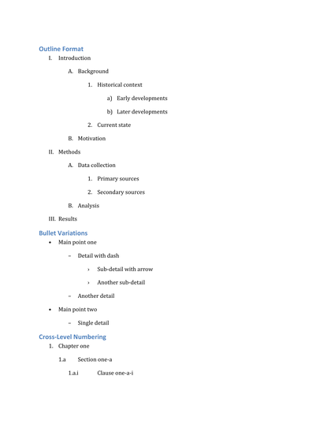

## case21 — 93.9% SSIM

 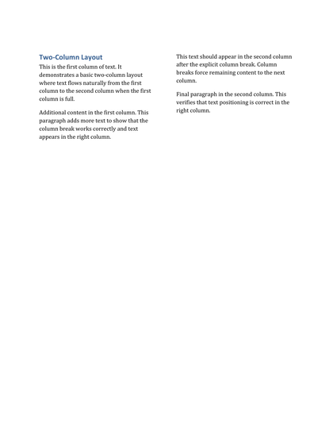

## case22 — 93.3% SSIM

 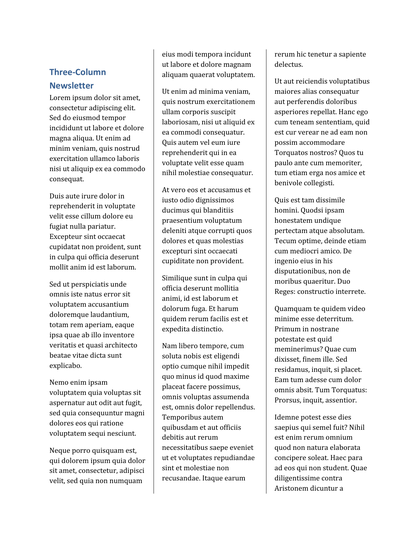

## case23 — 89.4% SSIM

 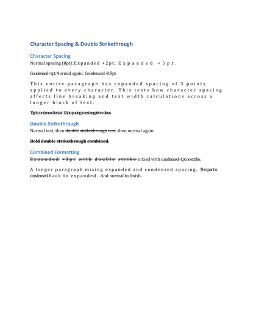

## case24 — 93.1% SSIM

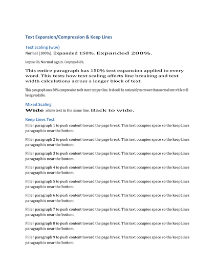 

## case25 — 89.2% SSIM

 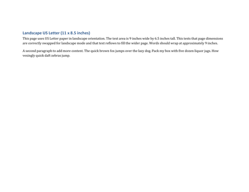

## case26 — 91.4% SSIM

 

## case27 — 99.0% SSIM

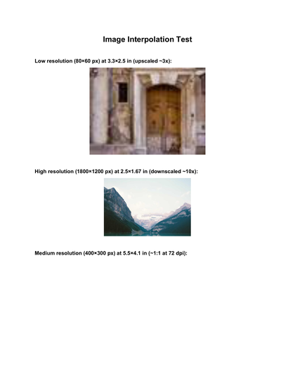 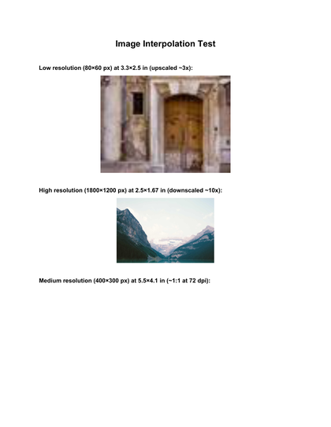

## case28 — 90.1% SSIM

 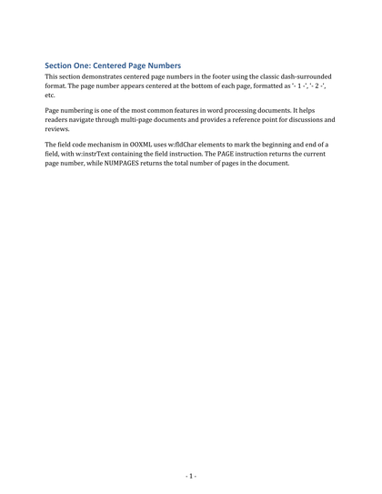

## case29 — 69.3% SSIM

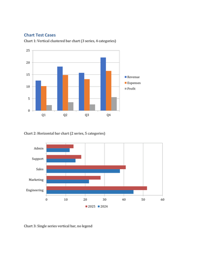 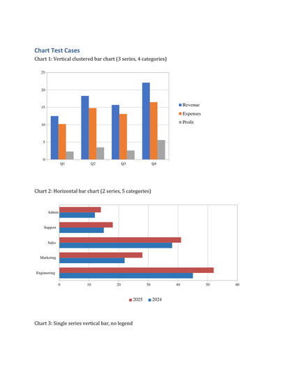

## case30 — 82.3% SSIM

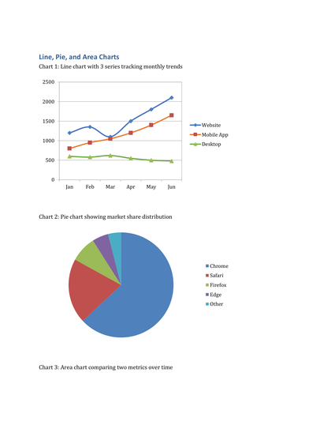 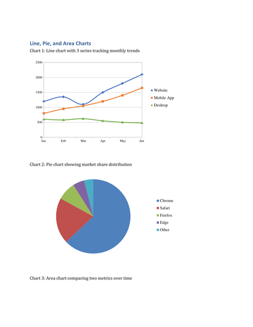

## case31 — 76.1% SSIM

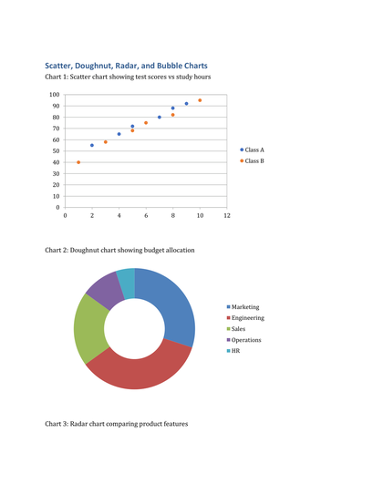 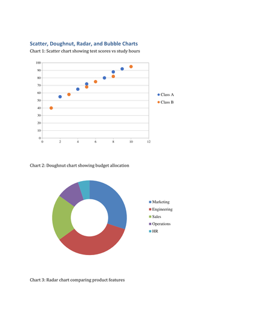

## case32 — 76.0% SSIM

 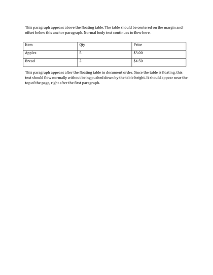
